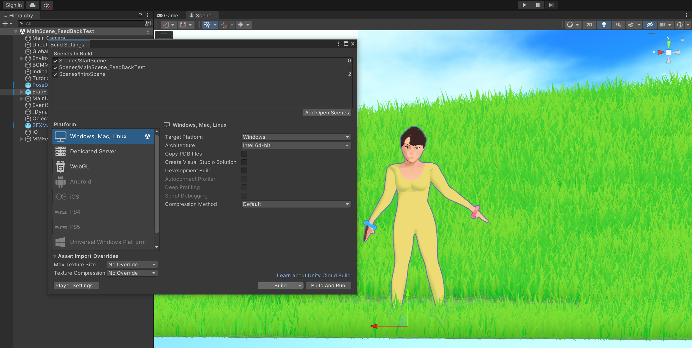

# Danceology Building
## Overview
This document provides the details on how to make a build for the Danceology application.

## Creating Build
1. Click on `File -> Build Settings` to open the Build Settings window
2. Select the desired platform for building (Windows, Linux, Mac). If development logging is needed, check the "Development Build" box
3. Click on "Build". This will open a window to select a folder to output the build, then start the build

