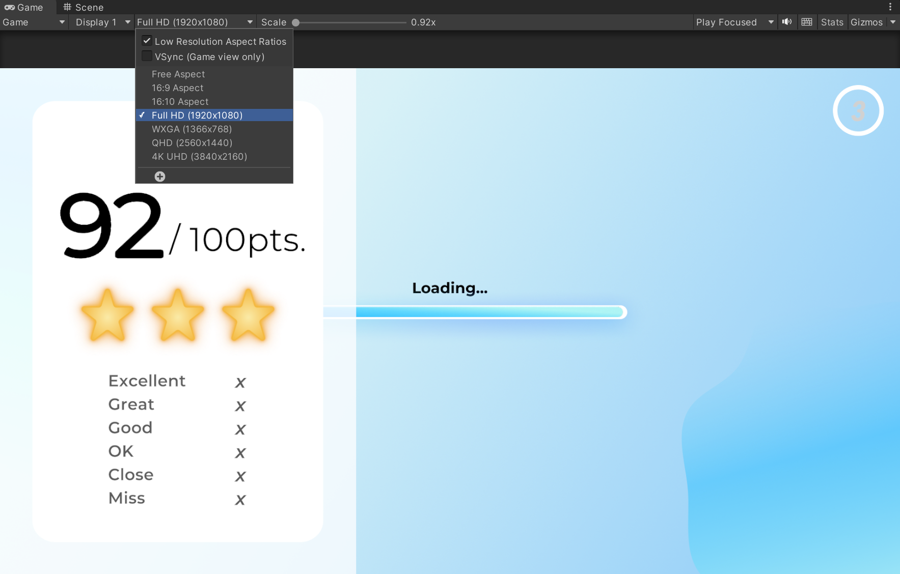

# Danceology Installation
## Overview
This document provides the details on how to install and set up a development environment for the Danceology project. All of the following documentation will assume a certain amount of familiarity with [Unity](https://docs.unity.com/) and [Git/GitHub](https://docs.github.com/en) technologies.

## Setup
### Repository Link
TODO: Include repository link

### Tech Requirements
#### Unity
The majority of the Danceology code is developed in C# within the [Unity](https://unity.com/download) game engine version 2021.3.15f1.

Unity provides download instructions for Unity Hub and the Editor itself; the specific version used for this project can be found [here](https://unity.com/releases/editor/archive).

It is recommended to modify Unity files using the [Visual Studio](https://visualstudio.microsoft.com/downloads/) IDE. 

#### ML Model
Within the Unity application, we used a customized .onnx build of an [OpenPose](https://github.com/CMU-Perceptual-Computing-Lab/openpose) machine learning model. 
TODO: Determine how we will distribute this model (can we upload to the repo? provide via google drive?)

### Installation Steps
1. Download and install [Unity Hub](https://unity.com/download) and [Unity Editor version 2021.3.15f1](https://unity.com/releases/editor/archive). When downloading the Editor, ensure that you add modules for all the platforms you wish to build for (usually, this includes Windows, Linux, and Mac)
2. [Clone](https://docs.github.com/en/repositories/creating-and-managing-repositories/cloning-a-repository) the Danceology repository locally (TODO: include link)
3. Open Unity Hub -> Projects -> Open -> Select the Danceology project folder

### Development Setup
#### Util Functions
In Unity, clicking on the "Run" button will start running the game from the currently open scene. However, as most development happens in the "Game" scene, it becomes bothersome to manually swap scenes before running.

As a shortcut, you can click on `Util -> Set Starting Scene` to automatically set the default starting scene to the "StartScreen" scene. This will need to be clicked once every time the editor is first opened.

#### Play Mode
To run a Unity game in the Editor, click on the Play button at the top of the window. This will automatically direct you to the game mode screen.

All of the UI was built to best work on a "Full HD" aspect ratio. You can use the dropdown at the top of the game screen to adjust the screen ratio.

