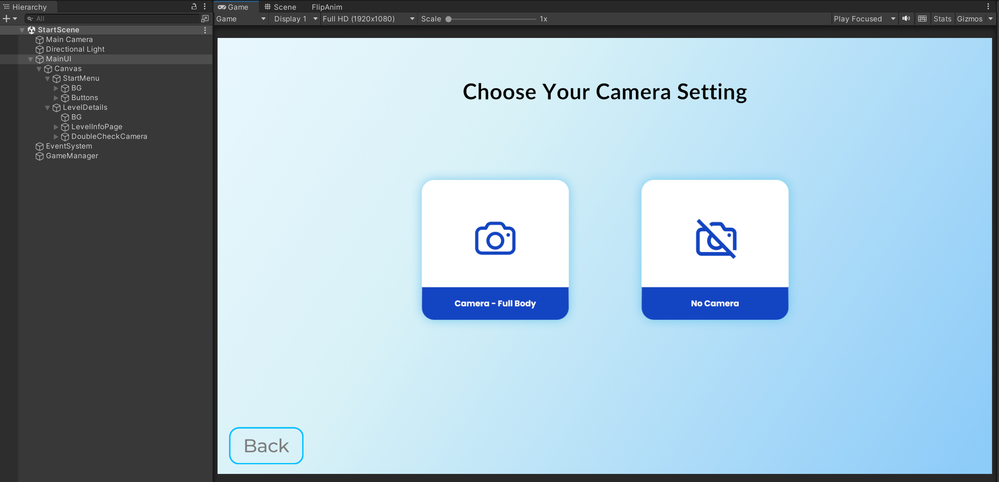
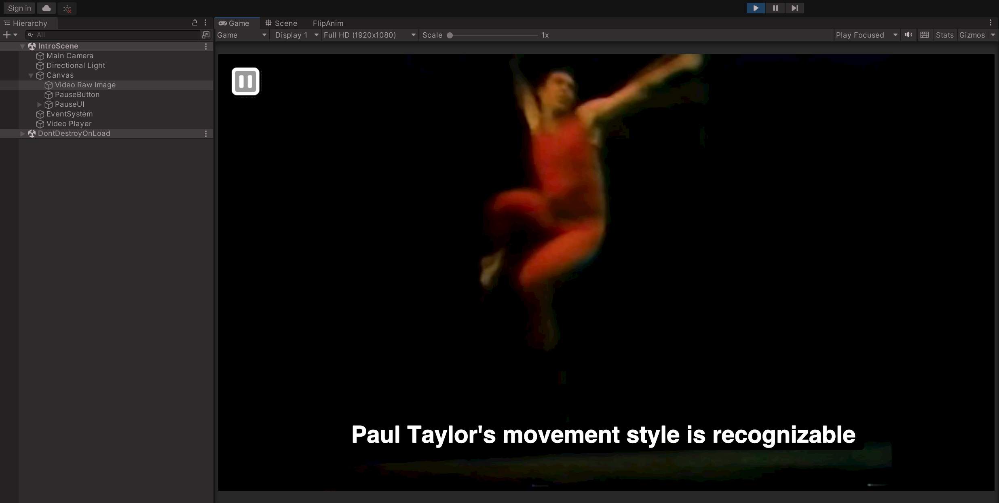
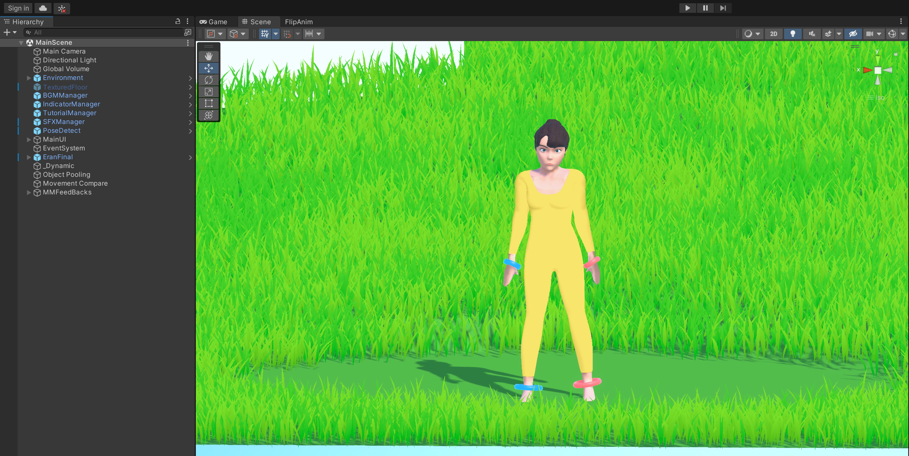
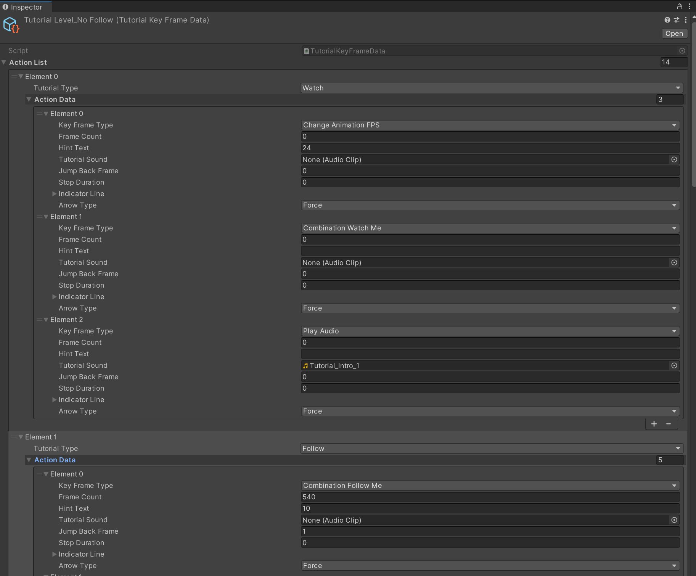

# Implementation
## Overview
This document provides implementation details on the Danceology project; specifically, we will provide details on how different features are being implemented and what the main gameplay loop looks like from the implementation-side.

For further Unity documentation see their [User Manual](https://docs.unity3d.com/Manual/UnityManual.html).

## Scene Breakdown
The following sections provide a general overview of what happens behind-the-scenes in a given play session within each of the three main scenes.

### Start Scene

When the application is first started, the user is presented with a series of menus within the `StartScene`. Each of these UI menus has a series of different buttons that swaps out the window, stored player settings based on their selections, etc. All the UI assets can be found under the `MainUI` GameObject in the Hierarchy Inspector.

All of the exact interactions are handled by local UI scripts attached to the UIs themselves, which in turn interact with the `GameManager` to manipulate the scene. This `GameManager` will persist throughout the entire experience and store all the key data associated with that given session.

The user will go through starting the experience, selecting a level, and, if applicable, configuring their camera settings. Afterwards, the appropriate level will be loaded with the user's settings.

### Intro Scene

In the special case of the Intro level being selected, the user will be brought immediately to the `IntroLevel` scene, within which they will be presented with an introduction video. As this level has no progression or feedback, it will play the video until the end before exiting back to the starting menu.

The video itself is rendered on the `Video Raw Image` GameObject, which has a `RawImage` UI components that takes in a video texture. The video texture and the source video itself can be found within the `Assets/Textures/Videos` directory; to swap out the introduction video, you can swap out the `Intro Video.mov` video file stored here.  

### Main Scene

For all other levels, the `MainScene` is loaded. There are a number of key GameObjects within this scene that work together to allow a user to smoothly progress through the experience.

Some of the key GameObjects to be aware of here:
- `PoseDetect`: Contains all the logic for webcam-based pose detection of the player throughout the experience, along with connecting the output from the ML model to the various scripts that will compare the player's motions with the reference data and display the player's joint positions on the screen
- `MainUI`: Overall GameObject that contains all of the UI assets used within the game
- `EranFinal`: Final 3D model that performs the Back Exercise animation. It contains an `AnimModelMovement` component that drives its motions and all frame-based logic throughout the rest of the level
- `Movement Compare`: Receives the webcam input data from `PoseDetect` and performs actual movement comparison

Note that `GameManager` is created in the `StartScene` and persists into this one.

There are two distinct types of levels that are served by the `MainScene`: tutorial (guided, voiced over, having distinct visual effects and pacing) and standard (unguided, no voice-over, indicators for next pose, scoring and feedback).

#### Overview

The `GameManager` will trigger different stages of the experience based on the following 6 states declared within the `Assets/Scripts/Data/GameState.cs` file:

- `GameStart`: Triggered once a level has been selected from the initial main menu
- `Loading`: As soon as a game is started, all related assets and preparations are conducted during this loading phase. This phase starts with the loading bar shows up and lasts until loading is finished
- `LevelPrepare`: Any additional level preparation before the main gameplay loop is started. If the user selected to experience the level with a webcam, this state includes the camera calibration phase before a user fully jumps into the level
- `LevelStart`: Called once a level is actually about to begin, after the level preparation has concluded. In this stage, any level-specific information is initialized and loaded
- `InLevel`: This phase lasts as long as the level lasts. Typically, this means going until the 3D animation has concluded, i.e. until the entire exercise has been performed
- `LevelEnd`: This phase is triggered right when the level ends, and will remain until the player choose to progress (go to the next level), restart the current level, or exit back to the main menu.

All of the levels will follow this progression flow, and the scripts will perform different actions depending on which state we are currently in.

#### Tutorial

The tutorial levels are driven by a `TutorialKeyFrameData` ScriptableObject, whose details can be found in its corresponding `Assets/Scripts/TutorialKeyFrameData.cs` script file. Within this scriptable object, a developer can customize the tutorial flow by determining which different events are triggered at each frame of the animation. 

Generally speaking, all events should be added to the `ActionList`, where `Frame Count` will denote the frame where the event is triggered, `Key Frame Type` specifies the type of event to trigger, and all other fields provide supplemental details on how the event should behave. More detailed information on each of the fields and different types of events can be found documented within the `TutorialKeyFrameData.cs` file.

Once created, the tutorial data is attached to the `AnimModelMovement` component of the `EranFinal` GameObject. The current tutorial data can be found in the `Assets/Data` directory.

All of the different types of events within the tutorial are read from this ScriptableObject and actualized by the `TutorialManager` script. Once the entire tutorial flow has concluded, the level will end.

#### General

The general levels will provide specific feedback and manipulate the UI according to the reference video data generated by the [external ML component](https://github.com/ETCDanceology/Danceology-ML) of this project. 

Firstly, the given level data is read in from a `.json` file in the `Assets/Resources` folder using the functions provided in the `Assets/Scripts/Data/LevelData.cs` file. Once read, the level data will contain all of the keypoints (both 2D and 3D) for the loaded file along with a list of **Key Poses**. For the entirety of the experience, we refer to poses/frames where we score the user as "key poses", and they are what the team identified to be the most identifiable "poses" within the back exercise. As of the final build, only the 2D and key pose data are used for pose matching; 3D data is no longer being used to directly drive model animation.

On each input frame from the webcam, the frame is passed to the OpenPose ML model via the `PoseDetector` script; the output of this model is converted using the `OpenPoseOutputProcessor` class, and `MovementCompare` uses this information along with the reference keypoints to determine accuracy.

Movement scoring for this project was done in the following way:

1. Isolate a single person within the frame. Although OpenPose can track multiple people within a frame, we designed the movement comparison to be more consistent by tracking only a single person within the frame itself. This is denoted by the `mainFocus` parameter passed between the `PoseProcessing` files.
2. Extract the points (if they exist) for key joints and connections for both the player and reference. Specifically, we are measuring arms, legs, shoulders, and hip positions as we found these to be most accurate in measuring a person's position without being overly granular. These are declared at the top of the `MovementCompare` file.
3. Measure the slope between the two points for each of these connections (for instance, the slope to go from LForeArm to LHand) in both the player and reference data. Then, grab the angular difference between the player data and reference data. By using slope and angular difference, we minimize distance differences that are caused by differences in body proportions.
4. Scale the angular difference to a scored value - the smaller the angular difference, the higher the score.
5. To account for potential webcam delays, we repeat the above and score a few frames before & after the intended "key pose" frame, then take the maximum score across all.

There are a few more nuances in how we handle edge cases, such as:
- If a point was not captured by the webcam
- If a point was not present in the reference data
- If the distance between points was too miniscule (close to zero) and causes issues in calculations of the above

This scoring is then converted into a FeedbackUI displayed during the level along with being factored into the final score presented to the user after the level has ended.
